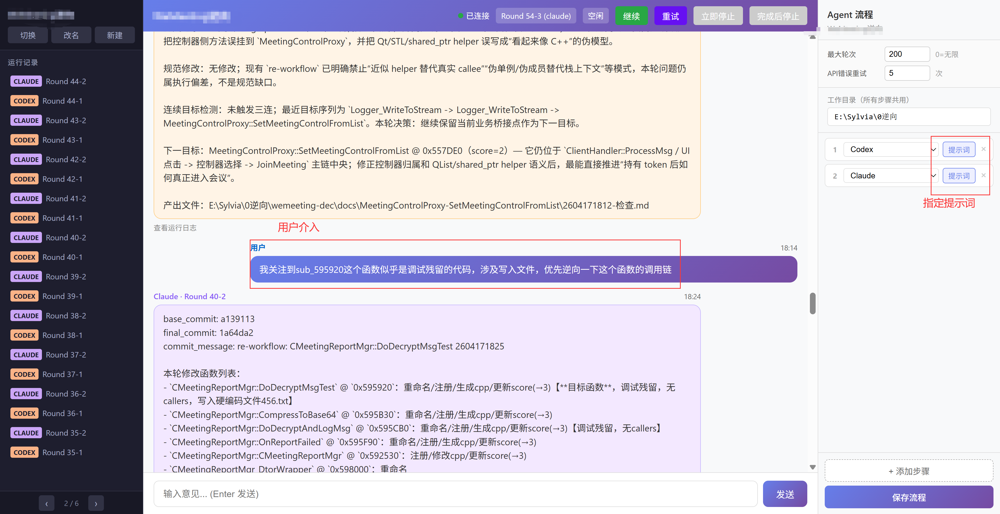
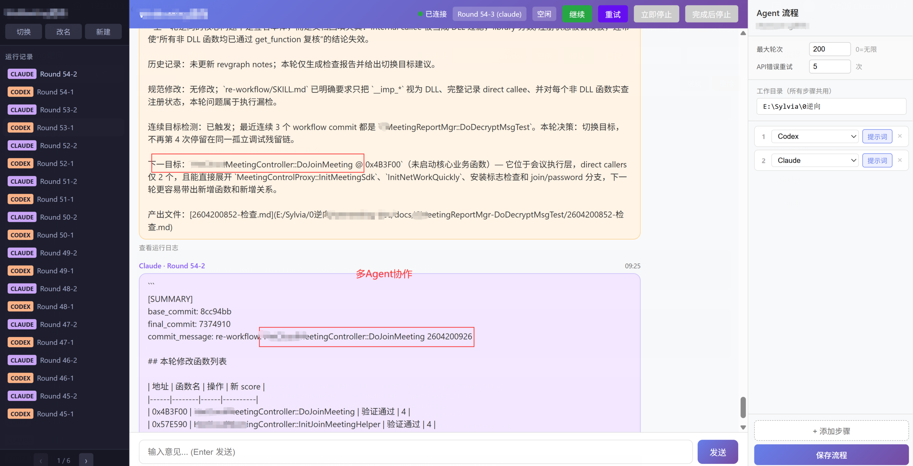
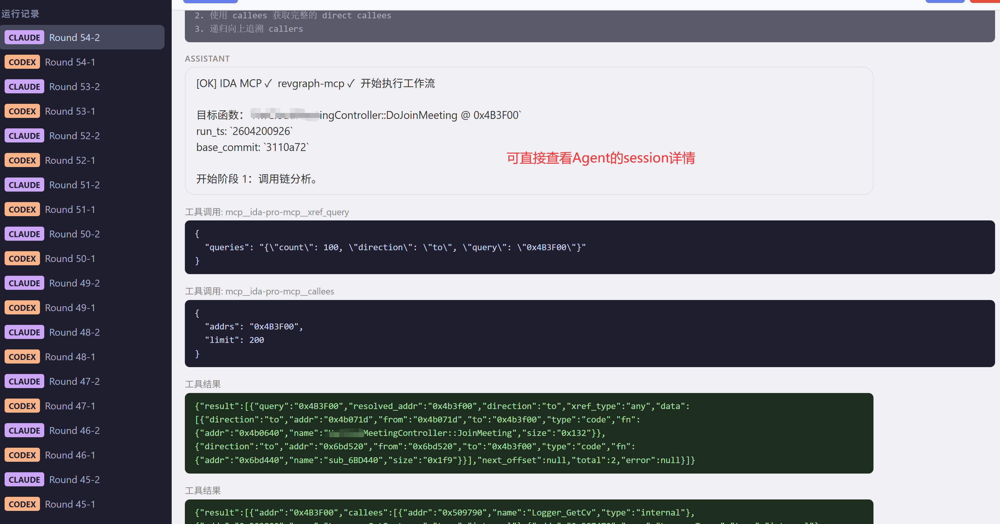

# MultiAgentRoundRunner

多 Agent 回合制循环执行框架，支持用户随时介入。将多个 AI Agent（如 Codex CLI、Claude Code）组织为可配置的 Pipeline，自动循环执行任务，并通过 Web 界面实时监控每个 Agent 的运行过程。









## 快速开始

### 安装依赖

```bash
pip install -r requirements.txt
```

### 安装 Agent CLI

```bash
# Claude Code
npm install -g @anthropic-ai/claude-code

# Codex CLI
npm install -g @openai/codex
```

### 启动

```bash
python -m backend.main
```

浏览器访问 `http://127.0.0.1:8765/`

### 基本操作流程

1. 在右侧 **Pipeline 面板**配置步骤和提示词模板，点击"保存流程"
2. 点击"**开始**"启动第一轮，系统依次运行 Pipeline 中每个 Agent
3. 左侧 Session 列表点击任意条目可**实时或历史**查看 Agent 的详细运行日志
4. 在底部输入框随时发送消息，内容将注入到下一步骤的 `{user_input}`
5. 使用"**停止**"/"**继续**"/"**重试**"控制执行流程
6. 在 Session 视图点击"**继续**"可携带新提示词从指定历史 Session 恢复运行
